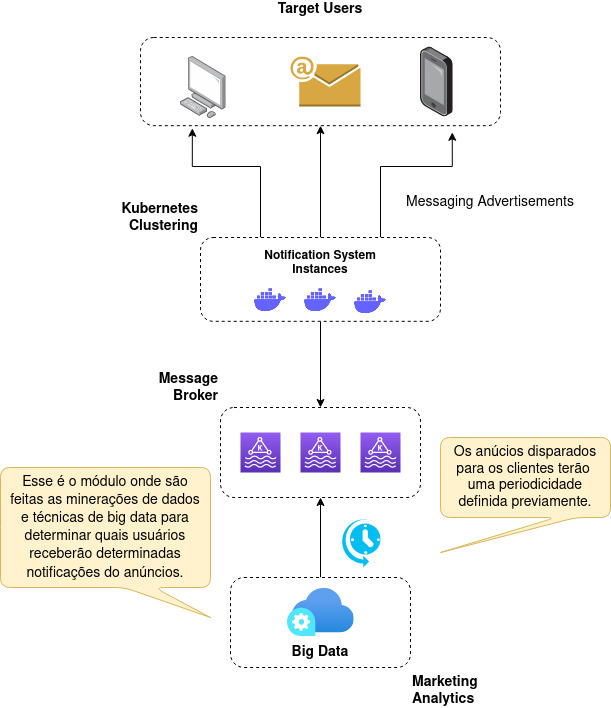

# Advertisement Notification System

This module has the responsibility of sending any advertisement notification to the customer asynchronously. To achieve this
aim this solution was implemented adopting a websocket communication. In this way, any interested user can subscribes in 
a specific message destination to be notified of any new advertisement. Our primary goals here:

* Provide a fast advertisement notifications without change the user experience.
* High availability decoupling the send notification system from the producer advertisement event module


## Installation Steps
* Install any JDK 11 or higher in your local environment. Once it is done, run the following command in your terminal 
to be sure the Java you picked up was set up properly.
```
$ javac --version
```
* Install the Docker containerization tool.
* Install the docker-compose (container manage tool) to set up the infrastructure need on starting up this application
* Once it is done, run the following commands to be sure everything is working fine
```
$ docker --version
```
```
$ docker-compose --version
```
* Clone this repository locally: https://github.com/viniciusfernandes/notification-system
* Run the following command under the project root folder to build the application runnable .jar file
```
$ ./gradlew build
```
* To start up this application, run these commands and keep this order:
```
$ docker-compose up
```
```
$ ./gradlew bootRun
```

## Getting Started

##### Sending notifications:
* Open your browser an type the following resource `http://localhost:8099/notification-system/index.html`
* Type User Id = 111 and press tab to blur this field. This was done to emulate a logging process by the user and enable him 
to receive any advertisement notification coming from the web server because all the notifications are going to be send for 
each user using his USER ID
* Hit the following endpoint to emulate the advertisements notification process that will be processed and sent to any customer
`POST => http://localhost:8099/notification-system/advertisement-notifications` and use the payload below:
```
[
    {
        "code": "12",
        "userId": "111",
        "userEmail": "viniciussf@hotmail.com",
        "title": "Promocao de celular",
        "description": "Promocao de IPhone até o dia 12/12/2023. Todos os modelos por R$999,99",
        "channel": "WEB"
    },
    {
        "code": "13",
        "userId": "111",
        "userEmail": "viniciussf@hotmail.com",
        "title": "Máquina de Lavar",
        "description": "Brastem máquina de lavar R$278,99 até o Natal",
        "channel": "WEB"
    },
    {
        "code": "14",
        "userId": "222",
        "userEmail": "marcos@hotmail.com",
        "title": "Promocao de Notebook",
        "description": "Notebook Samsung X221 I8 por R$1299,99",
        "channel": "WEB"
    },
    {
        "code": "15",
        "userId": "222",
        "userEmail": "marcos@hotmail.com",
        "title": "Promocao de Notebook",
        "description": "Notebook Samsung X221 I8 por R$1299,99",
        "channel": "EMAIL"
    },
    {
        "code": "16",
        "userId": "111",
        "userEmail": "marcos@hotmail.com",
        "title": "Promocao de Notebook",
        "description": "Notebook Samsung X221 I8 por R$1299,99",
        "channel": "MOBILE"
    }
]
```

* Wait 10 seconds and go back to the `index.html` page to check if all the advertisement for the customer ID=111 is there. You have to wait a little
because this process was scheduled to run in each 10 seconds.

#### Canceling notifications:

* Hit the following endpoint to cancel (user opt-out) the notifications for this specific user `POST => http://localhost:8099/notification-system/advertisement-exclusions/customers/111`
* Repeat the Sending Notifications steps and you can check the USER ID=111 will not receive the notifications anymore.

#### Enable notifications:
* If you want to enable the customer notifications again you can hit this endpoint `DELETE => http://localhost:8099/notification-system/advertisement-exclusions/customers/111`
* Repeat the Sending Notifications steps and you can check the USER ID=111 will be able to receive notifications.

## About this Solution

### Scenario: Marketing and Data Mining  
There are many systems responsible to collect the customer interactions and their product preferences to process in order to 
decide what products are most likely to be offered to each customer according to their profile. Once all the data are ready to be sent to
the customers we need a new application just to manage this advertisement notifications.


#### Architectural Decisions

This solutions has two module: 
* The first one is the advertisement-notification-producer, responsible to manage all 
the advertisements coming from the marketing department, stores that advertisements data to publish it in a message broker
using a scheduled task
* The second one is the notification-system, responsible to listening all the messages published in that message broker
and decide for what channel the customer must be notified.

Why split it in two? Taking this way, we can keep both services working fine even if one of them crashes suddenly, avoiding
any consequence. Suppose the notification system is crashing, then the marketing department still able to send ads
notifications to the system while the notification system is down.

Why taking a message approach? In my point of view this approach enables  different marketing areas on 
send advertisement notifications, for example: the section responsible for selling houses, the sections responsible for selling cars,
the section responsible for selling sports products and so on. So, if the notification-system is taking so long on processing 
messages anyone of this systems will get any consequence because they still able to send the advertisements notifications
to the broker.



#### Technical Issues
* In this first solution version the notification-producer code base is in the same git repository than the
notifications-system, this decision was due to simplify the code base presentation, but it could be split in a another repository.
* This solution was designed to connect with a MongoDB running in a aparted container, but as we were getting authentication issues 
we decided to change the database strategy to run a custom database, how you can see in `AdvertisementHashTableRepository.java` file. 
This database strategy be switched changing the property `database.strategy` in the `application.yml`.

## Getting Help
Are you having trouble on running this application? Send an email to viniciussf@hotmail.com and we will reply to you as soon as we can

